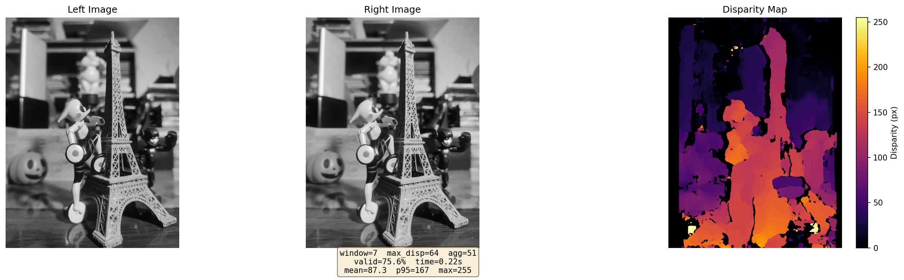
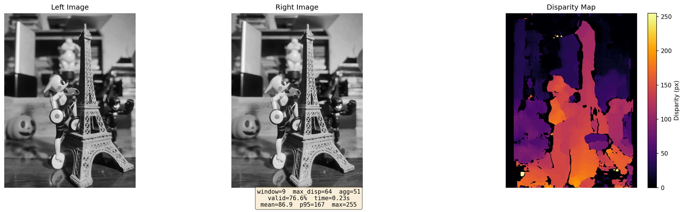
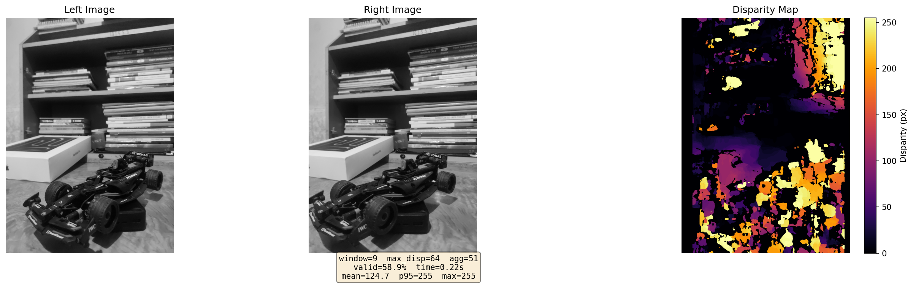

# A1 — Image Sensing, Digital Image and Disparity

**CSCI-6527 — Introduction to Computer Vision, Spring 2026**

Stereo disparity estimation using the Census Transform. Given a pair of left/right images captured with a smartphone, the code computes a dense disparity map that encodes relative depth.

---

<details>
<summary><strong>Assignment Instructions (click to expand)</strong></summary>  

**Instructions for the project:**
Capture several stereo images (at different time of the day, indoor/outdoor, using different lighting conditions) using one of the available applications that automatically adjusts the images. To gain a better disparity map, make sure to have multiple objects with various textures set at various distance from the camera (you may use a painting or bookshelf as a background):

Write a report in a README file, describing the camera properties, the lighting condition and other details. Show a color range used in each image.  
Write a code that prepares a disparity map using Census Transform. Use different window size and compare the results. All the documentation shall be in the project’s readme file.

**Notes on the programming part:**

- Use Python programming language
- All the images and source codes shall be submitted to the GitHub repo.
- Keep images in a separate folder (one folder for original and separate folders for the output of each task).
- Write a clean and readable code.
- Write a good Readme file that guides the user (instructor).

When done, please submit your GitHub repo link here.
</details>

## Camera & Capture Setup

| Property | Value |
|----------|-------|
| Device | Xiaomi 12 |
| App | CrossCam (Google Play) |
| Resolution | 3072 × 4096 (12.6 MP) |
| Scene | Indoor |
| Lighting | Varied — different lamp color temperatures across captures |

Three stereo pairs were captured indoors using different lamps to test the algorithm's behavior under warm, neutral, and cool lighting conditions. CrossCam automatically aligns and crops the left/right images to approximate a rectified stereo pair.

---

## Project Structure

```
├── run.py                  # Main script — compute disparity and visualize
├── tune_params.py          # Grid-search parameter tuner
├── clean.py                # Clear all generated outputs
├── requirements.txt
├── src/
│   ├── census.py           # Census Transform (Numba-accelerated)
│   ├── disparity.py        # Disparity computation, LR check, post-processing
│   └── utils.py            # Image I/O and stereo pair discovery
└── images/
    ├── original/           # Stereo pair 1 (warm light)
    ├── dataset1/           # Stereo pair 2 (neutral light)
    ├── dataset2/           # Stereo pair 3 (cool light)
    └── outputs/            # Generated disparity maps (per-dataset folders)
        ├── original/
        ├── dataset1/
        └── dataset2/
```

---

## Installation

```bash
python -m venv .venv
source .venv/bin/activate
pip install -r requirements.txt
```

**Requirements:** Python 3.10+, NumPy, OpenCV, Numba, Matplotlib.

---

## How to Run

### Compute a disparity map

```bash
python run.py --pairs_dir images/original --out_dir images/outputs/original \
  --scale 0.25 --window 9 --max_disp 64 --agg 51 --lr_thresh 2
```

| Argument | Default | Description |
|----------|---------|-------------|
| `--pairs_dir` | `images/original` | Folder containing `*_left.*` / `*_right.*` images |
| `--out_dir` | `images/outputs` | Where to save the visualization |
| `--scale` | `1.0` | Resize factor (0.25 = quarter resolution) |
| `--window` | `9` | Census window size (odd, ≥ 3) |
| `--max_disp` | `64` | Maximum disparity to search (pixels) |
| `--agg` | `51` | Cost aggregation window (odd; 0 = off) |
| `--lr_thresh` | `2` | Left-right consistency threshold |
| `--no_viz` | — | Skip visualization, print stats only |

### Run on all datasets

```bash
for dataset in original dataset1 dataset2; do
  python run.py --pairs_dir images/$dataset --out_dir images/outputs/$dataset \
    --scale 0.25 --window 11 --max_disp 64 --agg 51 --lr_thresh 2
done
```

### Tune parameters

```bash
python tune_params.py \
  --scales 0.25 0.5 \
  --max_disps 64 96 128 \
  --windows 7 9 11 \
  --aggs 25 51 75 \
  --lr_threshes 1 2 \
  --topk 10
```

This runs a parallel grid search over all parameter combinations and prints the top results ranked by a composite score.

---

## Method

### Census Transform

The Census Transform encodes local structure around each pixel as a binary string. For every pixel, each neighbor within a `window × window` region is compared to the center: the result is `1` if the neighbor is darker, `0` otherwise. This produces a compact bit-string descriptor that is robust to global illumination changes.

### Disparity Computation

1. **Census descriptors** are computed for both left and right images.
2. **Matching cost** between left pixel `(y, x)` and right pixel `(y, x−d)` is the Hamming distance (number of differing bits) between their census descriptors.
3. **Cost aggregation** applies a box filter over the cost volume to smooth noise.
4. **Winner-takes-all (WTA)** selects the disparity `d` with the lowest aggregated cost.
5. **Left-right consistency check** computes disparity from both directions and keeps only pixels where left and right estimates agree within a threshold.
6. **Median filter** (5×5) removes residual speckle noise.

### Color Range

Each visualization uses the **inferno** colormap with a colorbar showing the disparity range in pixels. Darker colors represent near objects (small disparity), brighter colors represent far objects (large disparity). Invalid pixels (rejected by the LR check) appear as black (disparity = 0).

---

## Window Size Comparison

All runs use: `scale=0.25`, `max_disp=64`, `agg=51`, `lr_thresh=2`.

### Original (warm light)

| Window | Valid % | Time |
|--------|---------|------|
| 7×7 | 75.6% | 0.22s |
| 9×9 | 76.6% | 0.23s |
| **11×11** | **77.5%** | 0.26s |

| Window 7 | Window 9 | Window 11 |
|----------|----------|-----------|
|  |  |  |

### Dataset 1 (neutral light)

| Window | Valid % | Time |
|--------|---------|------|
| 7×7 | 75.6% | 0.22s |
| 9×9 | 76.6% | 0.23s |
| **11×11** | **77.5%** | 0.26s |

| Window 7 | Window 9 | Window 11 |
|----------|----------|-----------|
|  |  |  |

### Dataset 2 (cool light)

| Window | Valid % | Time |
|--------|---------|------|
| 7×7 | 58.0% | 0.20s |
| 9×9 | 58.9% | 0.22s |
| **11×11** | **59.6%** | 0.25s |

| Window 7 | Window 9 | Window 11 |
|----------|----------|-----------|
|  |  |  |

### Observations

- **Larger windows produce higher valid %** across all datasets. An 11×11 window captures more spatial context, making the census descriptor more discriminative and the LR check pass rate higher.
- **The effect is consistent** regardless of lighting conditions, confirming the Census Transform's robustness to illumination variation.
- **Dataset 2 shows lower valid %** (~59% vs ~77%), likely due to differences in scene geometry or texture rather than lighting alone.
- **Runtime scales mildly** with window size (0.22s → 0.26s), making larger windows a good tradeoff.

---

## Cleaning Outputs

```bash
python clean.py
```

Removes all files from `images/outputs/`.
