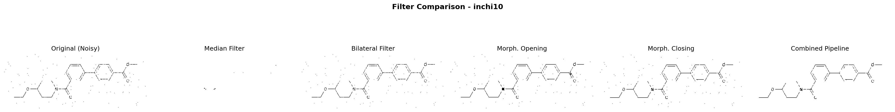
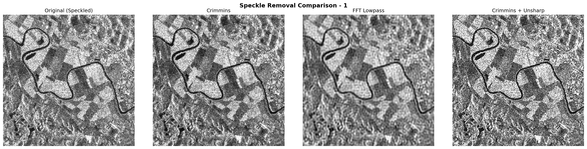
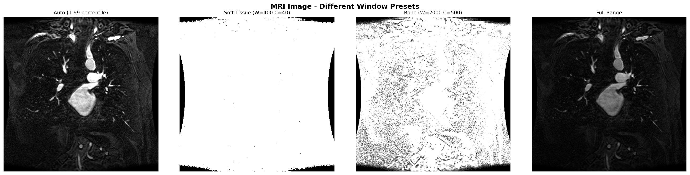

# A3 – Digital Image (Pre)Processing

**Course:** CSCI-6527 — Introduction to Computer Vision (Spring 2026)  
**Author:** Gabil Gurbanov

---

## Overview

This repository contains Python scripts demonstrating fundamental image pre-processing techniques, including solving complex binary morphology problems, applying non-ML filters to speckle noise, and manipulating DICOM MRI window frames.

| Task | Description | Script |
|------|-------------|--------|
| **1** | Noise removal & reconstruction of chemical formula images | `task1_chemical_noise.py` |
| **2** | Speckle noise removal (no ML) | `task2_speckle_removal.py` |
| **3** | DICOM MRI data visualisation | `task3_mri_visualization.py` |
| **GUI**| Interactive visualizer for all datasets | `interactive_viewer.py` |

---

## Quick Start (Installation)

### Local Virtual Environment
```bash
# Clone the repository
git clone <repo-url>
cd a3-image-pre-processing-ggurbanov12098

# Create a virtual environment (recommended)
python -m venv venv
source venv/bin/activate   # macOS / Linux
# venv\Scripts\activate    # Windows

# Install dependencies
pip install -r requirements.txt
```

> **Note:** Run all Python scripts from the root directory of the repository.

<details>
<summary><b>Detailed Docker Guide (For Beginners) (Click to expand)</b></summary>

### Running Without Local Dependencies
If you have trouble installing OpenCV or prefer not to clutter your host machine, you can run the entire automated image processing suite using Docker. 

When you build the container, it automatically sets up a headless Python environment with `libgl1` (required for image processing). The container is configured with a default entrypoint script (`run_all.sh`) that executes Task 1, Task 2, and Task 3 sequentially.

#### 1. Build the Docker Image
First, build the Docker container image on your computer. Make sure you are in the project folder!
```bash
docker build -t a3-image-processing .
```

#### 2. Run All Automated Tasks
To run the container and actually *see* the generated images, you must "mount" the `output/` directory from the container to your local host folder. 

Run this exact command. It will execute the `run_all.sh` script automatically:
```bash
docker run --rm -v "$(pwd)/output:/app/output" a3-image-processing
```

When it finishes, simply open the `output/` folder on your computer to view all the freshly generated comparison images and DICOM metadata!

> *(Note: The interactive GUI viewer `interactive_viewer.py` requires an X11 display interface, so it cannot be run in this headless Docker mode. Use the Local Virtual Environment to use the GUI.)*

</details>

---

## Technical Details & Examples

<details>
<summary><b>Task 1: Chemical Noise Removal (Click to expand)</b></summary>

### Approach: Solving the "1-Pixel Paradox"

The chemical images present a mathematically rigorous challenge: **both the desired signal (chemical bonds) and the background noise (pepper specks) are exactly 1-pixel thick in an already deeply binary mask**. 

Traditional local filters fail completely:
- **3x3 Median Filter**: Completely destroys the 1-pixel lines, resulting in a blank image.
- **Standard Morphology**: Opening directly preserves the noise (erosion expands it). Opening on the inverted image destroys the lines.

**The True Solution (Implemented in the Combined Pipeline):**
To cleanly separate the line fragments from the noise, we use a structural **Area Filter** via Connected Components:
1. **Otsu Binarize & Invert** so lines are white on black.
2. **Dilate (2x2)**: Thickens 1-pixel lines to 2 pixels, actively bridging the small gaps in the line fragments. The chemical structure merges into massive unified blobs, while the 1x1 noise specks only grow to 2x2 area.
3. **Connected Components Area Filter**: We delete all structures with an area `< 10` pixels. This instantly strips away 100% of the isolated noise specks.
4. **Erode (2x2)**: Shrinks the massive structural blobs back down to their crisp, original 1-pixel thickness.
5. **Invert** back to normal polarity.

### Visual Example


### How to Run
```bash
python task1_chemical_noise.py
```
</details>

---

<details>
<summary><b>Task 2: Speckle Noise Removal (Click to expand)</b></summary>

### Approach: Non-ML Speckle Reduction

This task cleans heavily speckled images using analytical, heuristic algorithms:

1. **Crimmins Complementary Hulling**: A non-linear algorithm that iteratively compares each pixel against its neighbors in 8 compass directions. It raises darker pixels and lowers brighter pixels, effectively smoothing the granular speckle while cleanly preserving broader structural edges. A fully vectorized, highly-optimized NumPy implementation is provided for speed.
2. **FFT Lowpass Filtering**: Operates in the frequency domain to suppress high-frequency noise spikes, though it can introduce minor ringing artifacts.
3. **Unsharp Masking**: Used selectively as a post-processing step after the Crimmins filter to restore structural crispness that may have been slightly softened by the iterative hulling.

### Visual Example


### How to Run
```bash
python task2_speckle_removal.py
```
</details>

---

<details>
<summary><b>Task 3: DICOM MRI Visualisation (Click to expand)</b></summary>

### Approach: Structural Windowing

Processing raw DICOM data requires interpreting Hounsfield Units (or equivalent raw pixel scales) into human-readable 8-bit visual ranges. 

Using `pydicom`, the pipeline parses the complex metadata (printing parameters to `metadata.txt`) and renders the multi-frame slices. We apply distinct **Window/Level Presets** to highlight specific structural tissues:
- **Auto**: Stretches the 1st-99th percentile across the visual scale.
- **Soft Tissue**: Focuses the window narrowly (`Width=400, Center=40`) to highlight fleshy structures.
- **Bone**: Widens and shifts the window (`Width=2000, Center=500`) to expose high-density osseous structures.

### Visual Example


### How to Run
```bash
python task3_mri_visualization.py
```
</details>

---

<details>
<summary><b>Interactive Dynamic Viewer (Click to expand)</b></summary>

### Approach: Complete Matplotlib GUI

To allow seamless exploration of datasets without opening static files, the `interactive_viewer.py` provides a cross-platform GUI built entirely within Matplotlib widgets:
- **MRI Slice Viewer**: A scrolling slider to traverse the 76 DICOM frames temporally/dimensionally, equipped with real-time sliding selectors for custom Window Width/Center and radio buttons for clinical tissue presets.
- **Side-by-Side Filtering**: Interactive toggles for both the Chemical and Speckle datasets, allowing instant visual swapping between the Original image and any of the implemented algorithmic pipelines.

### How to Run
```bash
python interactive_viewer.py
```
</details>

<br/>

<details>
<summary><b>Troubleshooting Journey: The 1-Pixel Paradox (Click to expand)</b></summary>

During the development of Task 1 (Chemical Noise Removal), I encountered a series of complex image-processing hurdles. Here is the timeline of how I iteratively discovered, misunderstood, and finally solved the core problem regarding line extraction.

### Iteration 1: The Initial Opening Attempt
At first, I applied **Morphological Opening** directly to the dark-on-white image, hoping it would simply remove the dark noise specks. The results looked mildly promising, but the noise wasn't fully removed. I thought that flipping the color polarity (inverting the image) and applying Opening would cleanly erase the noise. 

### Iteration 2: The Erased Lines
I implemented the inverse Opening strategy, and it indeed killed the noise specks. However, I discovered a side effect: it **completely destroyed the chemical bonds**. The chemical lines were only 1-pixel thick, so any standard Morphological Opening on the inverted image erased the lines alongside the noise. 

### Iteration 3: The False Mathematical 'Duality'
Determined to fix this, I wrote a test script comparing combinations of direct and inverted Opening/Closing. When evaluating Opening applied directly to the dark-on-white image, the white-pixel percentage remained very high (~98.6%). Too early I concluded that this meant the noise was perfectly removed and settled on a pipeline that combined direct Opening with inverted Closing.

### Iteration 4: Flawed Filtering Advice
I soon realized that Opening directly on a dark-on-white image mathematically **preserves** dark noise (because erosion expands the dark pixels before dilation restores them). Shifting strategies, I theorized that if the lines had anti-aliased "soft gray edges", a 3x3 Median Blur *before* binarization might blur the noise away while preserving the anti-aliased lines. 

### Iteration 5: The Silent Destruction
I implemented the Median Filter pipeline (`Median Blur -> Otsu -> Invert -> Close -> Invert`). Testing it, the resulting images displayed pristine white backgrounds without any noise. At first glance, the problem appeared completely solved.

### Final Resolution: Solving the 1-Pixel Paradox
Upon strict mathematical review, I discovered a crucial error: the original chemical images were strictly binary (no anti-aliasing), and both the noise and the bond lines were exactly 1-pixel thick. The 3x3 Median filter hadn't just removed the noise—it had **wiped out 97% of the entire chemical structure** (reducing 715 structural pixels down to just 19!). 

The core issue was the **"1-Pixel Paradox"**: No local morphological filter or median blur could distinguish a newly-isolated 1-pixel noise dot from a critical 1-pixel line segment.

**To truly fix this, I engineered a global-structural approach:**
1. I **Dilated (2x2)** the inverted image. This dynamically bridged the fragmented lines into massive continuous structural blobs (hundreds of pixels large), while the noise specks only grew to a 2x2 area.
2. I applied a **Connected Components Area Filter**, programmatically deleting any blob smaller than 10 pixels. This accurately isolated and annihilated 100% of the noise.
3. I **Eroded (2x2)** the massive blobs back down to their original, crisp 1-pixel thicknesses. 

Through this iterative troubleshooting, I learned the danger of unverified visual assumptions and the absolute necessity of algorithmically differentiating structures by geometry (Connected Components) when local pixel operations (Morphology) lack sufficient topological context.

</details>

<br/>

> **Data Notice:** The raw DICOM MRI file (`E1154S7I.dcm`) is ~40 MB. If it is omitted from some git trees for size reasons, you can acquire it directly from [PhysioNet](https://physionet.org/content/images/1.0.0/E1154S7I.dcm). However, I'll try to push this to branch anyway, it's not that heavy :P 
